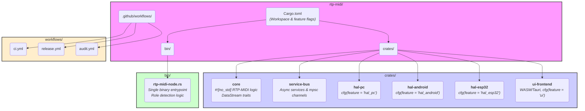

# rtp-midi: Modulární architektura pro real-time MIDI, audio a LED

Tento projekt využívá idiomatickou architekturu Rust workspace s oddělením core logiky, platformních HAL vrstev a samostatného UI. Všechny síťové odesílače a přijímače implementují sjednocené traity `DataStreamNetSender` a `DataStreamNetReceiver`.

## Klíčové principy architektury

- **Monorepo workspace**: Všechny crates jsou spravovány centrálně v root `Cargo.toml`.
- **Feature flagy**: Build-time selekce platforem (`hal_pc`, `hal_esp32`, `hal_android`, `ui`).
- **Modulární crates**:
    - `core`: Platformně nezávislá logika, traity, protokoly, no_std.
    - `hal-*`: Platform-specific implementace (PC, Android, ESP32).
    - `service-bus`: Asynchronní message passing (tokio mpsc).
    - `ui-frontend`: Oddělené UI (WASM/Tauri, WebSocket API).
- **Jediný binární entrypoint**: `rtp-midi-node.rs` autodetekuje roli a platformu za běhu.
- **Oddělené UI**: Samostatný crate, komunikace přes WebSocket.
- **CI/CD workflowy**: Automatizace buildů, testů, auditů.

## Přehledná struktura workspace



## Spuštění hlavního binárního souboru

Hlavní binární soubor `rtp-midi-node` lze spustit ve třech režimech podle role:

- **Server:**
  ```sh
  cargo run --bin rtp-midi-node -- --role server
  ```
- **Client:**
  ```sh
  cargo run --bin rtp-midi-node -- --role client
  ```
- **UI Host (webserver pro WASM UI):**
  ```sh
  cargo run --bin rtp-midi-node -- --role ui-host
  ```

Každý režim spouští odpovídající službu podle autodetekce role.

---
