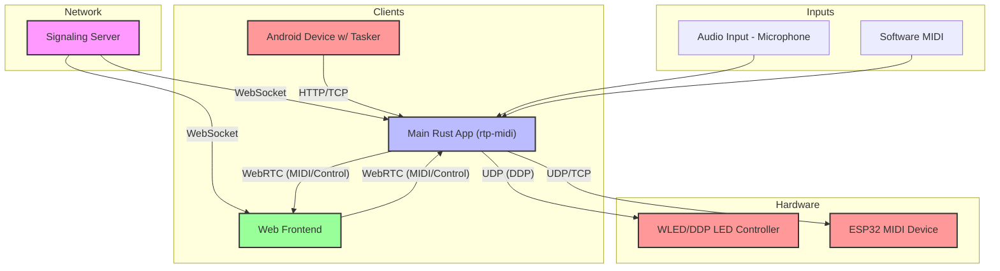
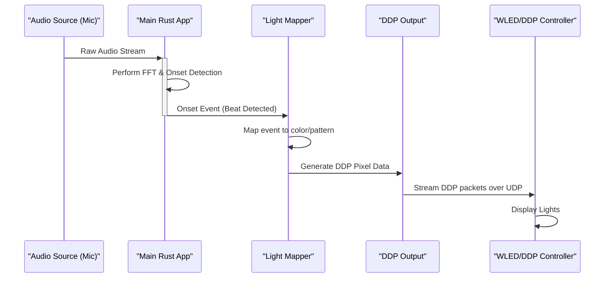
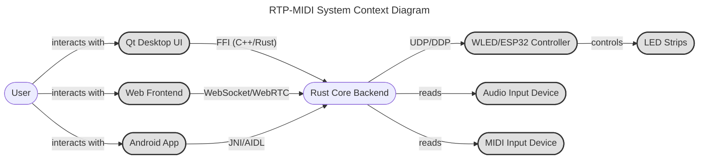
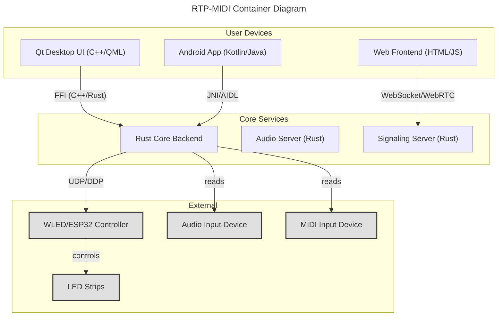
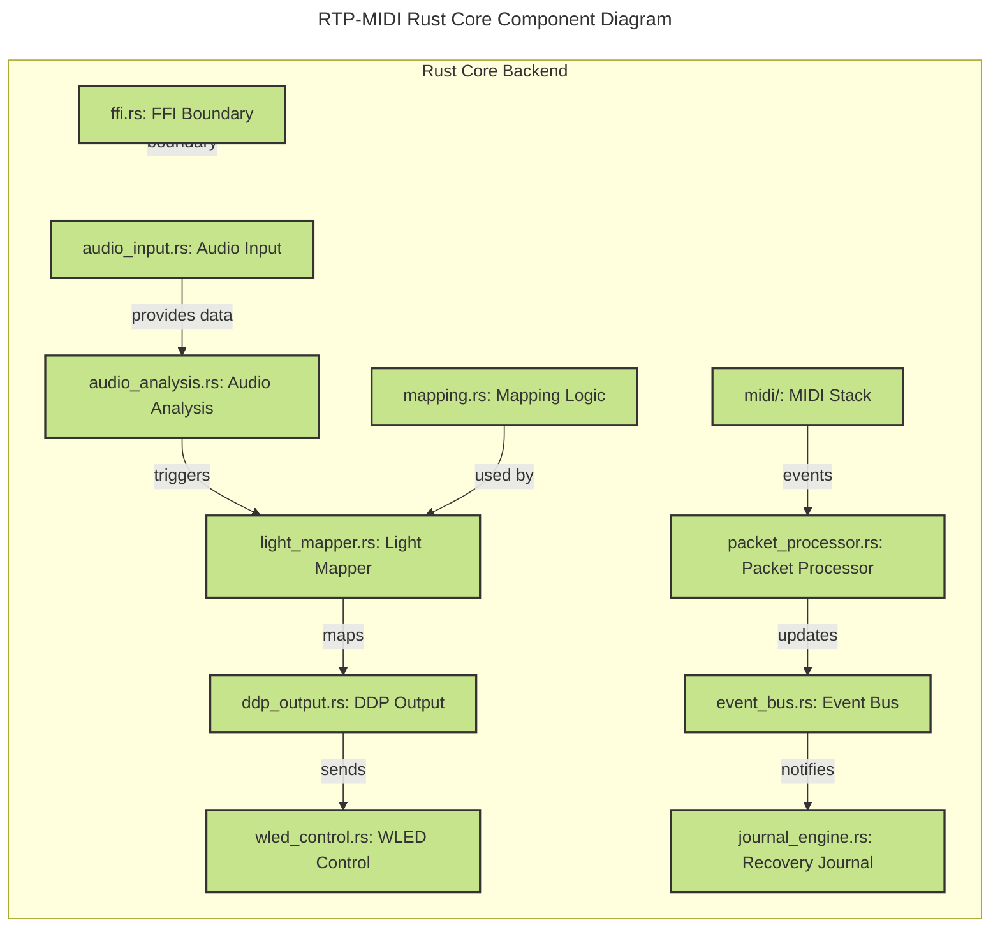
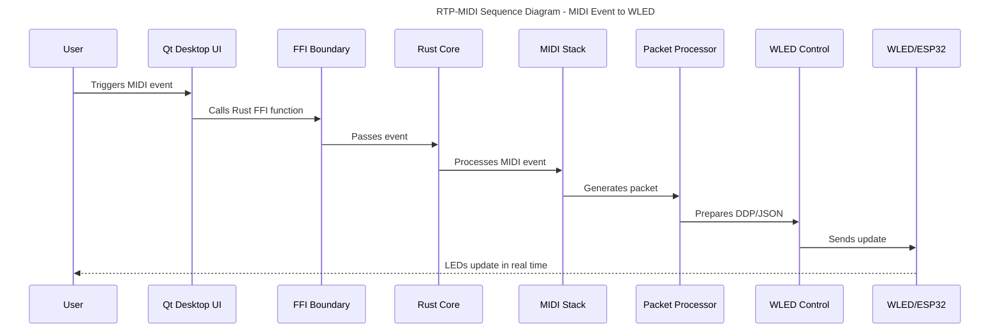
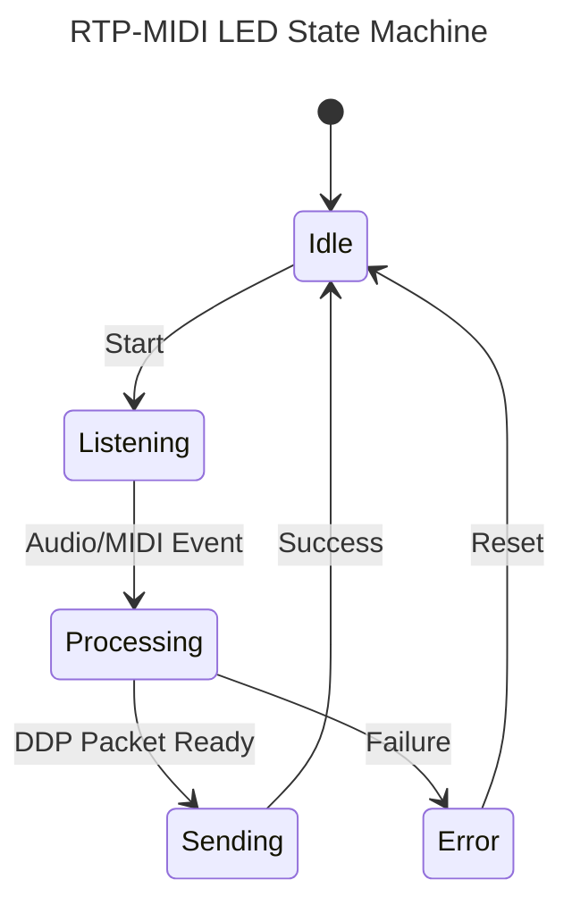

# Implementace WebRTC aplikace pro audio streaming a MIDI přenos

Na základě analýzy poskytnutých zdrojových kódů a dokumentace jsem vytvořil ucelené řešení pro WebRTC aplikaci, která umožňuje streamování audia a přenos MIDI dat v reálném čase. Řešení sestává ze tří klíčových komponentů: signalizačního serveru, audio serveru a klientské aplikace.

## Architektura systému

Systém je navržen jako modulární aplikace s těmito hlavními komponenty:

- **Signalizační server**: Spravuje WebSocket spojení, registruje klienty a směruje signalizační zprávy
- **Audio server**: Zpracovává audio streamy a MIDI data od klientů
- **Klientská aplikace**: Komunikuje se serverem a odesílá audio a MIDI data

### Struktura projektu

```
soundsystem-app/
├── Cargo.toml
├── src/
│   ├── main.rs                   # Vstupní bod aplikace
│   ├── signaling_server/         # Signalizační server
│   │   ├── mod.rs
│   │   └── main.rs
│   ├── audio_server/             # Audio server
│   │   ├── mod.rs
│   │   └── main.rs
│   ├── client_app/               # Klientská aplikace
│   │   ├── mod.rs
│   │   └── main.rs
│   ├── audio/                    # Audio subsystém
│   │   ├── mod.rs
│   │   ├── codec.rs              # Audio kodeky (Opus)
│   │   └── device.rs             # Správa zvukových zařízení
│   ├── midi/                     # MIDI subsystém
│   │   ├── mod.rs
│   │   ├── device.rs             # Správa MIDI zařízení
│   │   └── rtp/                  # RTP-MIDI implementace
│   │       ├── mod.rs
│   │       ├── packet.rs         # Struktura RTP paketů
│   │       └── session.rs        # Správa RTP relací
│   └── net/                      # Síťový subsystém
│       ├── mod.rs
│       ├── signaling.rs          # Signalizační protokol
│       └── webrtc.rs             # WebRTC konfigurace
```

## Implementace klíčových komponentů

### 1. [Signalizační server](./signaling_server/main.rs)
- umožňuje registraci audio serverů a klientů, směrování signalizačních zpráv

### 2. [Audio server](./audio_server/main.rs)
- zpracovává připojení od klientů, dekóduje audio streamy a MIDI data

### 3. [Klientská aplikace](./client_app/main.rs)
- generuje testovací audio a přeposílá MIDI zprávy ze vstupních zařízení

### 4. [RTP-MIDI implementace](./midi/rtp/packet.rs)
- umožňuje spolehlivý přenos MIDI dat po síti

### Technologický stack

- **WebRTC** - pro peer-to-peer audio streamy
- **Opus** - pro vysoce kvalitní audio kódování s nízkým zpožděním
- **WebSocket** - pro signalizaci
- **MIDI** - pro přenos hudebních dat

### Rozšíření

Pro produkční nasazení by bylo vhodné implementovat:

- **Autentizaci a autorizaci** - zabezpečení proti neoprávněnému přístupu
- **Šifrování** - zajištění důvěrnosti přenášených dat
- **Víceuživatelské mixování** - pro kolaborativní hudební tvorbu
- **Webové rozhraní** - pro snadnou správu a monitoring

# Rust MIDI/Audio to WLED/LED Service (Android)

## Overview

This project implements a modular, production-grade Rust service for Android that synchronizes MIDI and audio input with addressable LEDs via WLED (JSON API, DDP). It supports:
- RTP-MIDI input (via network, e.g., from MIDI Hub)
- Audio-reactive LED control (FFT, mapping, DDP output)
- WLED preset/effect control (JSON API)
- Android integration via AIDL (service + UI)

## Architecture

- **Rust core**: Modular, idiomatic Rust (see `src/`)
  - `audio_input.rs`: Audio capture (cpal)
  - `audio_analysis.rs`: FFT, feature extraction (rustfft)
  - `light_mapper.rs`: Audio→LED mapping
  - `ddp_output.rs`: DDP output (ddp-rs)
  - `wled_control.rs`: WLED JSON API
  - `config.rs`: Loads config.toml
  - `android/aidl_service.rs`: AIDL service stub
- **Android UI**: Minimal Kotlin/Java app (in progress)
- **Tasker path**: See `tasker/README.md` (TODO)

## Configuration

All user-configurable parameters are in `config.toml`:
- `wled_ip`: IP address of WLED controller
- `ddp_port`: UDP port for DDP (default: 4048)
- `led_count`: Number of LEDs
- `color_format`: "RGB" or "RGBW"
- `audio_device`: Name of audio input device (optional)
- `test_midi_port`: RTP-MIDI port (default: 5004)
- `log_level`: Logging verbosity

## Android Integration (AIDL)

- The Rust service exposes an AIDL interface (`IMidiWledService.aidl`) for control from Android UI or other apps.
- Methods: `startListener`, `stopListener`, `setWledPreset`, `getStatus`
- See `src/android/aidl_service.rs` for the Rust stub.
- The Android UI app (in progress) binds to this service for user control.

## Tasker Automation Path (Prototype)

- See `tasker/README.md` for rapid prototyping using Tasker, MIDI Hub, and plugins.
- This is a TODO; the production path is the Rust/AIDL service.

## Build & Deploy

- Cross-compile Rust for Android using the NDK (see Mozilla and AOSP docs)
- Build scripts (`build_android.sh`, `deploy_android.sh`) will automate this process (to be added)
- Deploy via ADB to a connected Android device

## Status

- Rust core modules: scaffolded and ready for integration
- Android AIDL service: stubbed, ready for implementation
- Android UI: in progress
- Tasker path: placeholder

## References
- [Mozilla: Building and Deploying a Rust library on Android](https://mozilla.github.io/firefox-browser-architecture/experiments/2017-09-21-rust-on-android.html)
- [AOSP: Android Rust introduction](https://source.android.com/docs/setup/build/rust/building-rust-modules/overview)
- [WLED JSON API](https://kno.wled.ge/interfaces/json-api/)
- [ddp-rs crate](https://github.com/coral/ddp-rs)

## RTP-MIDI: Real-time Audio-Visual Synchronization
RTP-MIDI is a comprehensive solution for real-time synchronization of MIDI data, audio analysis, and lighting control across a network. It leverages WebRTC for low-latency peer-to-peer communication, enabling interactive experiences between web interfaces, backend applications, mobile devices, and hardware controllers like the ESP32.
The system is designed to capture audio or MIDI events from one source and translate them into synchronized lighting effects on WLED or DDP-enabled devices, or to forward them to other MIDI-capable peers.

### Table of Contents

- [Architecture Overview](#architecture-overview)
- [System Components](#system-components)
- [Data Flow Diagram](#data-flow-diagram)
- [Key Features](#key-features)
- [Getting Started](#getting-started)
- [Prerequisites](#prerequisites)
- [Installation & Build](#installation--build)
- [Configuration](#configuration)
- [Running the System](#running-the-system)
- [Component Deep Dive](#component-deep-dive)
- [Signaling Server](#signaling-server)
- [Main Application (rtp-midi)](#main-application-rtp-midi)
- [Web Frontend](#web-frontend)
- [Android Integration](#android-integration)
- [Use Cases](#use-cases)

### Architecture Overview

The project is built around a central Rust application that communicates with various clients and hardware over the network. A signaling server is required to negotiate direct peer-to-peer (P2P) connections via WebRTC.

### System Components

1. Audio-Reactive LED Strip
2. Web-Based MIDI Controller for Hardware

### Data Flow Diagram



### Signaling Server

A simple WebSocket server written in Rust that helps clients find and connect to each other. It doesn't process any MIDI or audio data; it only brokers the initial WebRTC connection.

### Main Rust App (rtp-midi)

The core of the system. It can:
Capture system audio or receive MIDI events.
Analyze audio in real-time (e.g., onset/beat detection).
Connect to the signaling server and establish WebRTC peers.
Send and receive MIDI data over RTP.
Translate audio/MIDI events into lighting commands for DDP/WLED devices.
Communicate with hardware like the ESP32.
Web Frontend: An HTML/JS interface that runs in the browser. It connects to the signaling server to establish a WebRTC data channel with the main Rust app, allowing for two-way MIDI communication.
Android Integration: Allows for control via an Android device, using Tasker to send commands to the main application.
Hardware: LED controllers (running WLED or a DDP receiver) and custom MIDI devices (like an ESP32).

### Data Flow Diagram
This diagram illustrates how data flows through the system in a typical audio-reactive scenario.


Key Features
Real-time MIDI Transport: Send and receive MIDI messages over the network with low latency using RTP.
WebRTC Integration: Secure, peer-to-peer data channels between the backend and web clients.
Audio Analysis: Real-time audio processing to detect beats, onsets, and other features.
Reactive Lighting: Control network-enabled LED strips (WLED, DDP) in sync with music or MIDI events.
Cross-Platform: Components run on standard operating systems (Linux, Windows, macOS) and Android.
Extensible: Modular design in Rust makes it easy to add new inputs, outputs, or processing logic.

### Getting Started

#### Prerequisites
Rust: Install the Rust toolchain using rustup.
OpenSSL: Required for building dependencies.
On Debian/Ubuntu: sudo apt-get install libssl-dev pkg-config
On Fedora: sudo dnf install openssl-devel
On macOS: brew install openssl

#### Installation & Build

Clone the repository:
```bash
git clone https://github.com/sparesparrow/rtp-midi.git
cd rtp-midi
```

Build the project:
The project contains multiple binaries (the main app, the signaling server, etc.). Build them all using:
```bash
cargo build --release
```

The binaries will be located in the ./target/release/ directory.

#### Configuration

```toml
The main application is configured using the config.toml file.
# IP address of the signaling server
signaling_ip = "127.0.0.1"
# Port of the signaling server
signaling_port = 8080

# IP address of the DDP (WLED) light controller
light_controller_ip = "192.168.1.123"
# Port for the DDP controller (usually 4048)
light_controller_port = 4048

# Audio input configuration
[audio_input]
# Name of the audio device to capture from. Use "default" for the system default.
device_name = "default"
# Number of audio channels
channels = 2
# Sample rate for audio capture
sample_rate = 44100

#### Running the System

You need to run at least two components: the Signaling Server and the Main Application.
Start the Signaling Server:
Open a terminal and run:
```bash
./target/release/signaling_server
```

The server will start listening for WebSocket connections on the port specified (default 8080).
Start the Main rtp-midi Application:
In a separate terminal, run:
```bash
./target/release/rtp-midi
```

The application will start, connect to the signaling server, and begin its configured tasks (e.g., listening for audio).
Launch a Client (Optional):
Open the frontend/index.html file in a modern web browser. It will connect to the signaling server and establish a WebRTC connection with the main application.

### Component Deep Dive

#### Signaling Server

The signaling server is a crucial piece for establishing WebRTC connections. WebRTC peers need a way to exchange session information (called SDP offers/answers) and network candidate information (ICE candidates) to find each other on the network. The signaling server acts as this intermediary.
Workflow:
```mermaid
sequenceDiagram
    participant ClientA as Web Frontend
    participant SigServer as Signaling Server
    participant ClientB as Rust App

    ClientA->>+SigServer: Connect (WebSocket)
    ClientB->>+SigServer: Connect (WebSocket)

    ClientA->>ClientA: Create WebRTC Offer
    ClientA->>SigServer: Send Offer (for ClientB)
    SigServer->>ClientB: Forward Offer

    ClientB->>ClientB: Create WebRTC Answer
    ClientB->>SigServer: Send Answer (for ClientA)
    SigServer->>ClientA: Forward Answer

    Note over ClientA, ClientB: ICE Candidates exchanged similarly...

    ClientA<-->ClientB

```

#### Main Application (rtp-midi)

This is the central hub. Its primary roles are orchestrated in main.rs, which spawns threads for different tasks:
Audio Input (audio_input.rs): Uses the cpal crate to capture audio from a specified or default device.
Audio Analysis (audio_analysis.rs): Processes the raw audio buffer. It uses an FFT (Fast Fourier Transform) to analyze frequencies and an onset detection algorithm to identify beats.
Light Mapper (light_mapper.rs): Subscribes to events from the audio analyzer or MIDI input. It contains the logic for turning an event (like a beat or a MIDI note) into a specific color, brightness, or pattern.
DDP Output (ddp_output.rs): Takes the pixel data from the light mapper and sends it to an LED controller using the Distributed Display Protocol (DDP) over UDP.
WebRTC/RTP Logic: Manages the connection to the signaling server and handles the creation and management of peer connections for sending/receiving RTP MIDI packets.

#### Web Frontend

The frontend (frontend/index.html, frontend/script.js) provides a simple user interface for interacting with the system. Its script.js file handles:
Connecting to the signaling server via WebSocket.
Creating a RTCPeerConnection.
Handling the offer/answer/ICE candidate exchange to connect to the Rust backend.
Creating a RTCDataChannel for sending and receiving MIDI messages.

#### Android Integration

The Android integration allows for remote control of the rtp-midi instance.
AIDL Service (aidl_service.rs): Defines an Android Interface Definition Language (AIDL) service. This allows other Android apps (like Tasker) to bind to the rtp-midi background service and communicate with it.
Tasker (tasker/README.md): Provides instructions for setting up the Android automation app Tasker. You can create tasks that send HTTP requests or intents to the rtp-midi service to trigger actions, such as changing a light preset or starting/stopping audio analysis.

### Use Cases

1. Audio-Reactive LED Strip
Goal: Make an LED strip connected to a WLED controller pulse in time with music playing on a computer.
Setup:
Configure config.toml with the IP address of your WLED device.
Set audio_input.device_name to your computer's audio output (you may need a virtual audio cable application like VB-CABLE for this).
Run the signaling_server and rtp-midi binaries.
Play music on your computer. The lights should now react to the beat.
2. Web-Based MIDI Controller for Hardware
Goal: Use a web browser as a MIDI keyboard to play a hardware synthesizer connected to the computer running rtp-midi.
Setup:
Connect your hardware synthesizer via a USB-MIDI interface. The rtp-midi app will need to be configured to open a connection to this MIDI device.
Run the signaling_server and rtp-midi binaries.
Open frontend/index.html.
The web UI can now send MIDI notes through the WebRTC data channel to the rtp-midi backend, which then forwards them to the hardware synthesizer.

# RTP-MIDI Architecture Diagrams

The following diagrams provide a visual overview of the system architecture, following the C4 model and key workflows. These diagrams are rendered directly in GitHub using Mermaid syntax ([GitHub Blog](https://github.blog/developer-skills/github/include-diagrams-markdown-files-mermaid/), [GitHub Docs](https://docs.github.com/en/get-started/writing-on-github/working-with-advanced-formatting/creating-diagrams)).

> _Diagrams are written in [Mermaid](https://mermaid.js.org/intro/) and can be edited or rendered using the Mermaid Live Editor or compatible Markdown viewers._
> _Color themes are applied for clarity; you can customize them using Mermaid's frontmatter config._

## Context Diagram



## Container Diagram



## Component Diagram (Rust Core Backend)



## Sequence Diagram (MIDI Event to WLED)



## Class Diagram (Key Rust Core Types)

```mermaid
---
title: RTP-MIDI Rust Core Class Diagram
theme: forest
---
classDiagram
    class MidiEvent {
        +u8 channel
        +u8 note
        +u8 velocity
        +EventType event_type
    }
    class Packet {
        +Vec<u8> data
        +u32 timestamp
        +from_midi_event()
        +to_ddp_packet()
    }
    class LightMapping {
        +Vec<MappingRule> rules
        +map_audio()
        +map_midi()
    }
    class DdpPacket {
        +u8 header[10]
        +Vec<u8> payload
        +from_packet()
        +to_udp()
    }
    MidiEvent <.. Packet : "from_midi_event()"
    Packet <.. DdpPacket : "to_ddp_packet()"
    LightMapping <.. Packet : "map_midi()"
    classDef core fill:#c6e48b,stroke:#333,stroke-width:2px;
    class MidiEvent,Packet,LightMapping,DdpPacket core;
```

## State Diagram (LED State Machine)



---
