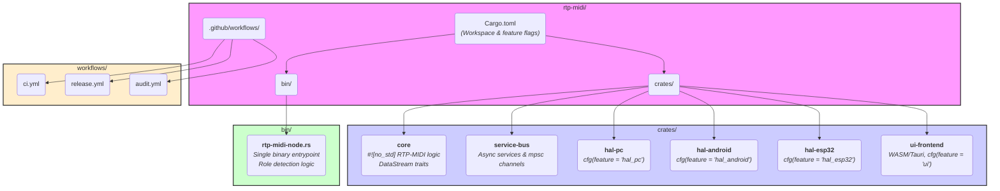

# TODO: implement architecture described below jak bude vypadat ideální architektura podle Rust principů

# Ideální architektura projektu `rtp-midi` podle idiomatických principů Rustu

## 1  |  Hlavní vrstvy a jejich odpovědnosti  

| Vrstva | Popis | Idiomatické prvky Rustu |
|--------|-------|-------------------------|
| **Core Domain** | Čistá implementace RTP-MIDI, směrování a časování bez závislosti na OS (`no_std`) | `#![no_std]`, `enum`-based state-machine, nulová alokace v kritických cestách [1] |
| **Service Bus** | Směrování rámců mezi pluginy (WLED mapper, vizualizér, efekty) | `async` channels (`tokio::sync::mpsc`), trait-object `dyn Service` [2] |
| **HAL Adapter** | Přístup k síti, GPIO, LED, audioserveru; implementace common traitů `embedded-hal` [3] | Feature-gated moduly `hal_pc`, `hal_android`, `hal_esp32` pomocí `cfg(feature="...")` [4] |
| **UI Front-end** | WebSocket REST rozhraní + volitelný lokální WebView | Separátní crate s `wasm32` targetem a `tauri` buildem [5] |
| **Binární entrypoint** | Společný `rtp-midi-node.rs`, který detekuje roli (Server / Client / UI host / Headless) | Pattern „single binary, multi-role“ s konfigurací přes `clap` [3] |

## 2  |  Abstrakce streamu dat  

```rust
pub trait DataStreamNetSender {
    fn init(&mut self) -> Result<(), StreamError>;
    fn send(&mut self, ts: u64, payload: &[u8]) -> Result<(), StreamError>;
}

pub trait DataStreamNetReceiver {
    fn init(&mut self) -> Result<(), StreamError>;
    fn poll(&mut self, buf: &mut [u8]) -> Result<Option<(u64, usize)>, StreamError>;
}
```
Implementace pro **RTP-MIDI, DMX, analog mic apod.** pouze naplní tyto traity; na PC lze vybírat dynamicky přes `Box<dyn DataStreamNetSender>`, na ESP32 staticky přes `enum` + `match`, čímž se minimalizuje flash footprint [6].

## 3  |  Rozdělení workspace  

```
rtp-midi/
 ├─ crates/
 │   ├─ core/           # čisté no_std jádro
 │   ├─ service-bus/
 │   ├─ hal-pc/
 │   ├─ hal-android/
 │   ├─ hal-esp32/
 │   └─ ui-frontend/
 ├─ bin/
 │   └─ rtp-midi-node.rs
 └─ Cargo.toml          # workspace + feature flags
```
Každý HAL crate implementuje stejné sady traitů definovaných v `core` a `service-bus`, takže binárka se kompiluje s `--features "hal_esp32"` či jinou kombinací podle cílového HW [1].

## 4  |  Dynamický výběr role při startu  

1. **Detekce periférií / build-flagů** (UART, Display) ⇒ předvyplní se možná role [3].  
2. **mDNS/SDP broadcast**: pokud již existuje Server, uzel přepne na Client; jinak server inicializuje [3].  
3. **WebSocket handshake**: přijde-li zpráva `EnableUI`, aktivuje se UI-host modul; jinak zůstane headless [2].

## 5  |  Bezpečnost a spolehlivost  

* **Typová bezpečnost**: vlastnictví a životnosti řídí borrow-checker; nulová tolerance k `unsafe` v core vrstvě [7].  
* **Oddělení privilegií**: každá služba běží v samostatném async tasku; selhání pluginu nezboří scheduler [8].  
* **Kryptografie**: volitelný `rustls` + mTLS mezi nody, aktivovaný feature flagem pouze na zařízeních s HW AES [9].

## 6  |  CI/CD a build strategie  

| Cíl | Nástroj | Důvod |
|-----|---------|-------|
| Multitarget build | `actions-rust-cross` | Sdílená binárka pro PC / Android / ESP32 z jednoho YAML [10] |
| LTO + panic = `abort` | `cargo --release -Zbuild-std` | O 30 % menší firmware na MCU [11] |
| Analýza závislostí | `cargo-audit` | Varuje před CVE ve třetích knihovnách [6] |

## 7  |  Shrnutí přínosů  

* **Jedna kódová báze, jedno API** – snadná údržba i rozšíření na další protokol.  
* **Maximální znovupoužitelnost** – core a service-bus běží beze změn od x86 po ESP32 [1].  
* **Idiomatický Rust** – traity místo dědičnosti, `no_std` tam, kde je to nutné, a feature-gated moduly pro modularitu [3].

Citations:
[1] embedded_hal - Rust - Docs.rs https://docs.rs/embedded-hal
[2] Master Hexagonal Architecture in Rust - How To Code It https://www.howtocodeit.com/articles/master-hexagonal-architecture-rust
[3] Adventures in abstraction with Rust's embedded-hal - fdi.sk https://fdi.sk/posts/embedded-life/
[4] Rust for Embedded - Is It Ready Yet? - inovex GmbH https://www.inovex.de/en/blog/rust-for-embedded-is-it-ready-yet/
[5] Rust's modules and project organization: best practices and pitfalls https://www.reddit.com/r/rust/comments/alsph9/rusts_modules_and_project_organization_best/
[6] Why I think embedded Rust is headed the wrong way http://blackforrest-embedded.de/2023/11/18/why-i-think-embedded-rust-is-headed-the-wrong-way/
[7] Modular Information Flow through Ownership https://arxiv.org/pdf/2111.13662.pdf
[8] W-Kernel: An OS Kernel Architecture Designed With Isolation and Customizability https://dl.acm.org/doi/10.1145/3637792.3637796
[9] Apache Arrow DataFusion: A Fast, Embeddable, Modular Analytic Query Engine https://dl.acm.org/doi/10.1145/3626246.3653368
[10] rust-unofficial/awesome-rust: A curated list of Rust code ... - GitHub https://github.com/rust-unofficial/awesome-rust
[11] Rust for Embedded Systems: Current State, Challenges and Open Problems
  (Extended Report) https://arxiv.org/pdf/2311.05063v1.pdf
[12] Técnica de confiabilidade em nível de sistema operacional para a arquitetura RISC-V https://periodicos.univali.br/index.php/acotb/article/view/20347
[13] The Architecture of the Language Faculty https://www.jstor.org/stable/417010?origin=crossref
[14] What is the idiomatic way of embed files into Rust binary? - Reddit https://www.reddit.com/r/rust/comments/kv8iev/what_is_the_idiomatic_way_of_embed_files_into/
[15] Demystifying Rust Embedded HAL Split and Constrain Methods https://dev.to/theembeddedrustacean/demystifying-rust-embedded-hal-split-and-constrain-methods-591e
[16] Part 2: Embedded Rust Ecosystem and Essential Crates https://www.systemscape.de/blog/2024/state-of-embedded-rust-2/
[17] 4-Step Primer on Navigating Embedded Rust HAL Documentation https://dev.to/theembeddedrustacean/4-step-primer-on-navigating-embedded-rust-hal-documentation-2d2m
[18] antoinecarton/hexagonal-rust: Hexagonal architecture in Rust - GitHub https://github.com/antoinecarton/hexagonal-rust
[19] Is anyone using Rust for embedded work - Reddit https://www.reddit.com/r/embedded/comments/1amh6jq/is_anyone_using_rust_for_embedded_work/
[20] Learning Rust : 15 - How you can organize your Rust code with ... https://dev.to/fadygrab/learning-rust-15-how-you-can-organize-you-rust-code-with-modules-2c28
[21] Lexipedia : A Multilingual Digital Linguistic Database https://www.semanticscholar.org/paper/abbc5ce292b72565a65bf2f79b276eda6de3c1a5
[22] DRust: Language-Guided Distributed Shared Memory with Fine Granularity,
  Full Transparency, and Ultra Efficiency http://arxiv.org/pdf/2406.02803.pdf
[23] Suki: Choreographed Distributed Dataflow in Rust http://arxiv.org/pdf/2406.14733.pdf
[24] Building an Efficient Multilingual Non-Profit IR System for the Islamic
  Domain Leveraging Multiprocessing Design in Rust http://arxiv.org/pdf/2411.06151.pdf
[25] rust-embedded/awesome-embedded-rust - GitHub https://github.com/rust-embedded/awesome-embedded-rust
[26] Introduction - Rust Design Patterns https://rust-unofficial.github.io/patterns/
[27] Embedded Rust: Introduction to Peripheral Access Crates (PACs) https://www.embedded.com/embedded-rust-introduction-to-peripheral-access-crates-pacs/
[28] AIS Electronic https://www.semanticscholar.org/paper/093a4b651c57e432055aecc11463386876f2dd8d
[29] The Embedded Rust Book - GitHub Pages https://ebarnard.github.io/2019-06-03-rust-smaller-trait-implementers-docs/embedded-book/print.html


# rtp-midi: Modulární architektura pro real-time MIDI, audio a LED

Tento projekt využívá idiomatickou architekturu Rust workspace s oddělením core logiky, platformních HAL vrstev a samostatného UI. Všechny síťové odesílače a přijímače implementují sjednocené traity `DataStreamNetSender` a `DataStreamNetReceiver`.

## Klíčové principy architektury

- **Monorepo workspace**: Všechny crates jsou spravovány centrálně v root `Cargo.toml`.
- **Feature flagy**: Build-time selekce platforem (`hal_pc`, `hal_esp32`, `hal_android`, `ui`).
- **Modulární crates**:
    - `core`: Platformně nezávislá logika, traity, protokoly, no_std.
    - `hal-*`: Platform-specific implementace (PC, Android, ESP32).
    - `service-bus`: Asynchronní message passing (tokio mpsc).
    - `ui-frontend`: Oddělené UI (WASM/Tauri, WebSocket API).
- **Jediný binární entrypoint**: `rtp-midi-node.rs` autodetekuje roli a platformu za běhu.
- **Oddělené UI**: Samostatný crate, komunikace přes WebSocket.
- **CI/CD workflowy**: Automatizace buildů, testů, auditů.

## Přehledná struktura workspace



---

