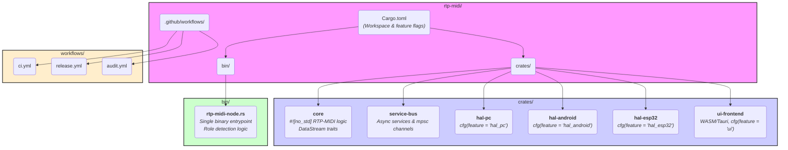
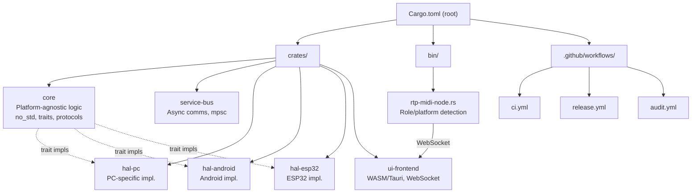
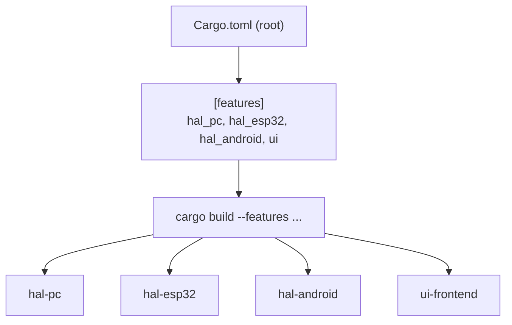
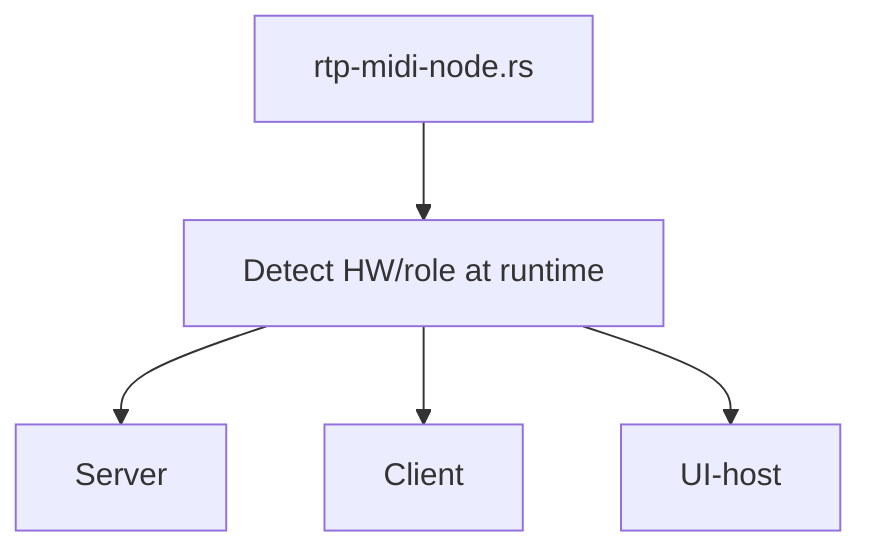
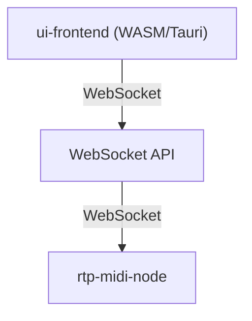
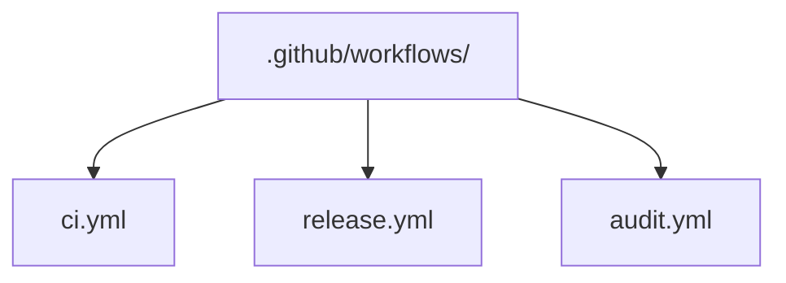

# Architektura projektu rtp-midi

Tento dokument shrnuje modulární a škálovatelnou architekturu projektu **rtp-midi** postavenou na idiomatických principech Rustu, jako jsou workspaces, feature-gated moduly a oddělení core logiky od platformně-specifického kódu.

---

## 1. Přehledná struktura workspace

---

## 2. Modulární crates a jejich role

- **core**: Platformně nezávislá logika, traity, protokoly, no_std.
- **hal-***: Platform-specific implementace (PC, Android, ESP32), aktivované feature flagy.
- **service-bus**: Asynchronní message passing (např. tokio mpsc).
- **ui-frontend**: Oddělené UI, např. WASM/Tauri, komunikace přes WebSocket.
- **rtp-midi-node.rs**: Jediný binární entrypoint, autodetekce role/platformy.

---

## 3. Feature flagy a build-time selekce

- V root `Cargo.toml` jsou definovány feature flagy pro jednotlivé platformy a UI.
- Build pouze relevantních částí pro danou platformu.

---

## 4. Autodetekce role a platformy za běhu

- Jediný binární soubor detekuje za běhu, na jakém HW běží a jakou má plnit roli.

---

## 5. Oddělené UI a WebSocket API

- UI je samostatný crate, který lze zkompilovat do WASM a připojit se k jakémukoliv rtp-midi-node přes WebSocket.
- UI je zcela oddělené od backendové logiky.

---

## 6. CI/CD workflowy

- Automatizace buildů, testů, auditů.

---

## Shrnutí klíčových principů

- **Workspace (Cargo.toml v rootu):** Spravuje všechny crates jako jeden celek, zjednodušuje build a správu závislostí. Definuje feature flagy (hal_pc, hal_esp32, ui).
- **core crate:** Obsahuje čistou, platformně nezávislou (no_std) logiku. Lze ji použít na PC i na mikrokontroleru.
- **hal-* crates:** Každý crate implementuje společné traity z core pro specifickou platformu. Aktivuje se pouze s příslušným feature flagem.
- **Jediná binárka:** Místo mnoha různých programů existuje jen jeden entrypoint, který při startu detekuje roli a platformu.
- **Oddělené UI:** Uživatelské rozhraní je samostatný crate, který lze zkompilovat do WASM a připojit se k backendu přes WebSocket.
- **Robustní, snadno testovatelná a rozšiřitelná architektura.** 